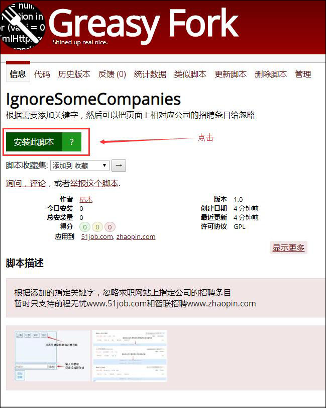
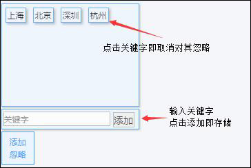
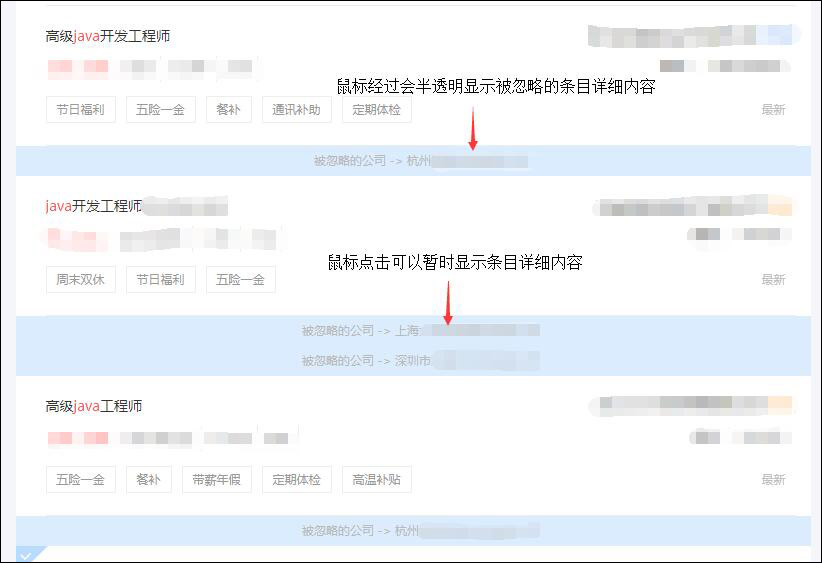

# IgnoreSomeCompanies

## 用途
在两个目标求职网站上根据指定的关键字（公司名称里的关键字），忽略指定公司的招聘条目。

## 目标网站
暂时只支持前程无忧www.51job.com和智联招聘www.zhaopin.com

## 运行环境
依托于Tampermonkey脚本管理器，已在Google Chrome、Mozilla Firefox和Microsoft Edge上测试正常使用（已知最低支持Chrome 50，其它两个不详），其它套壳并可以安装Tampermonkey的浏览器理论上也是可以运行的。

## 使用方式

- 在浏览器里通过其对应的下载方式下载安装第三方扩展Tampermonkey（另外两种脚本管理器Greasemonkey和Violentmonkey理论上也行，但是我没使用过，所以这里就不推荐了）。  

- 然后访问[Greasy Fork-IgnoreSomeCompanies](https://greasyfork.org/zh-CN/scripts/374962-ignoresomecompanies)，或者在该网站[Greasy Fork](https://greasyfork.org/zh-CN)上搜索**IgnoreSomeCompanies**（网站首页也有使用教程）来安装脚本。

- 来到相应的招聘网站进行搜索，然后会在**搜索结果页面**右下角看到“添加忽略”的按钮，此时说明脚本已经生效了。

## 其它声明

部分创意借鉴自另外一个扩展--眼不见心不烦（新浪微博）
