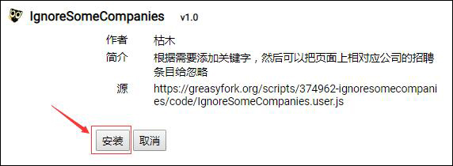

# IgnoreSomeCompanies

## 作用
根据指定的关键字，忽略求职网站上指定公司的招聘条目

## 目标网站
暂时只支持前程无忧www.51job.com和智联招聘www.zhaopin.com

## 运行环境
依托于Tampermonkey脚本管理器，已在Google Chrome、Mozilla Firefox和Microsoft Edge上测试正常使用（但所需浏览器最低版本不详）

## 使用方式

- 在浏览器里通过其对应的下载方式下载安装第三方扩展Tampermonkey（另外两种脚本管理器Greasemonkey和Violentmonkey理论上也行。但是我没使用过，所以这里就不推荐了）。

- 然后访问[Greasy Fork](https://greasyfork.org/zh-CN)，在该网站上搜索**IgnoreSomeCompanies**（网站首页也有使用教程），或者在安装了Tampermonkey之后点击[Greasy Fork-IgnoreSomeCompanies](https://greasyfork.org/zh-CN/scripts/374962-ignoresomecompanies)来安装脚本

- 来到相应的招聘网站搜索工作，然后会在右下角看到“添加忽略”的按钮，此时说明脚本已经生效了。

